# /home

- [main site](https://iamdavecon.github.io/)
- [discord aka Davecord](https://discord.gg/BdCQY2533X)

## Code of conduct

**Don't be an asshole**

## Release Notes

- [V](https://docs.google.com/document/d/1AGmxOIIG9FJRUuFvxuajCBeXXvTiyNuTyO-RnFlCKv4)
- [4.2](https://docs.google.com/document/d/1AzK0nzqCdaiZECCq4kKoY3V3NjuLak1vkBxOy_BbJ88)
- [3.14](https://docs.google.com/document/d/1oaGeMpaKX69vDvRT8u-n9noyw66Tj9VWQcM_10Sb85A)
- [2.1](https://docs.google.com/document/d/19L7Xp_Kvz2vSCQtCk9RlQ3hHlzpowm8FXnbNuoqx-NI)
- [1.0](https://docs.google.com/document/d/10pknMyp7eMQa5K1S5WkilPujUupOhHGwtNkq9URTMqg)
- [0.0 (beta)](https://docs.google.com/document/d/1GsItmplrJTlb02CClvNM4Jv8sW6bOXMFimozth7cOLA/edit#bookmark=id.o19r0bhabfy6)

## Badge Art

### DC30 (1.0)

| Front | Back |
| --- | --- |
| 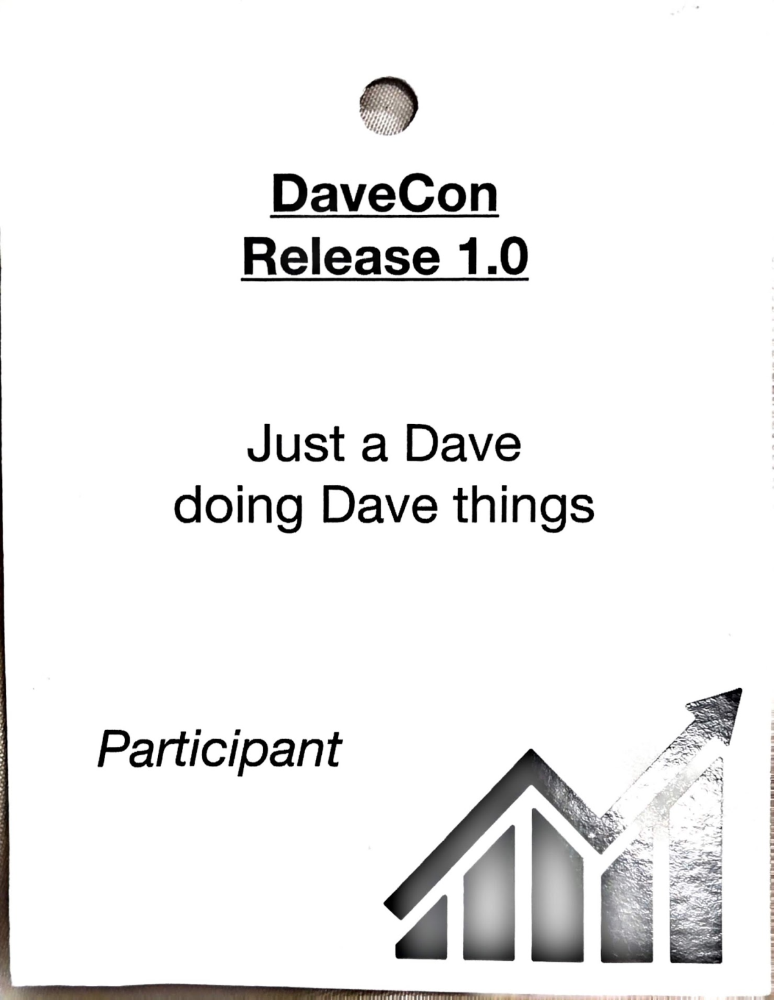 | 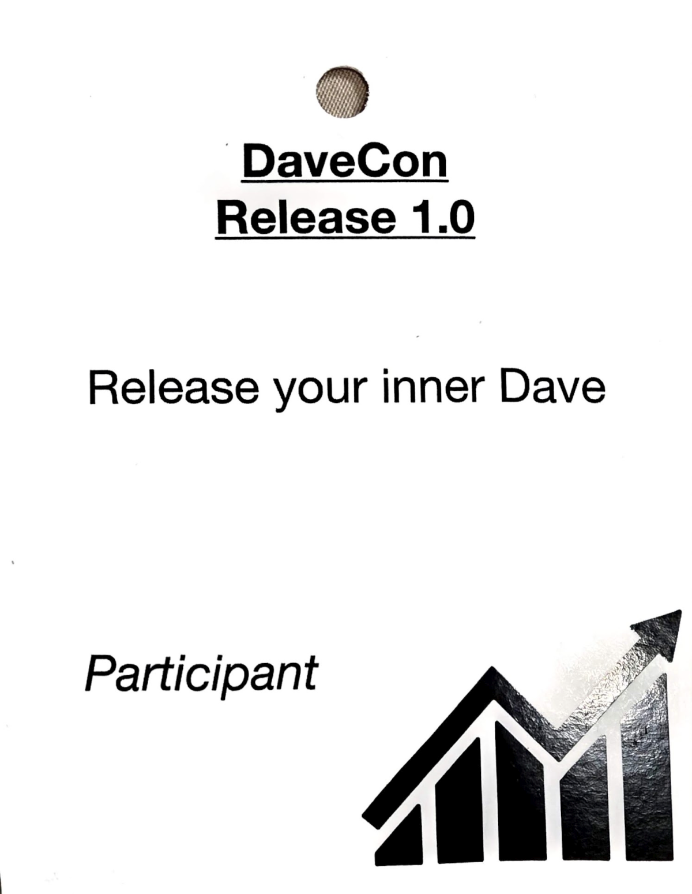 |

### DC31 (2.1)

| Front | Back |
| --- | --- |
| 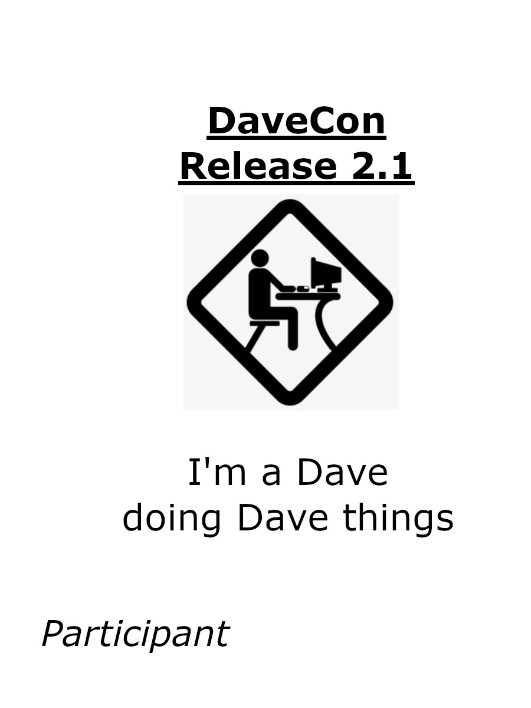 | 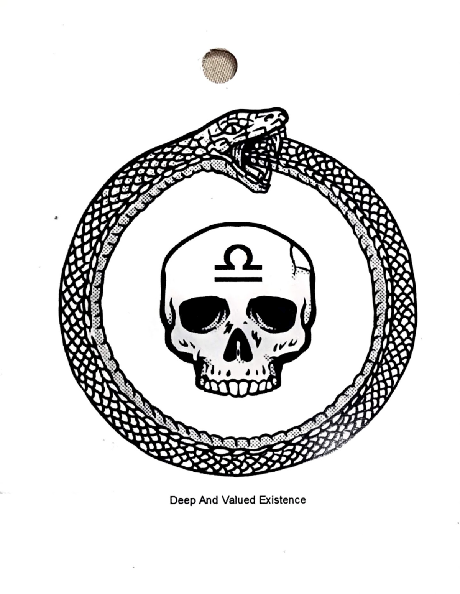 |

### DC32 (3.14)

| Front | Back |
| --- | --- |
| 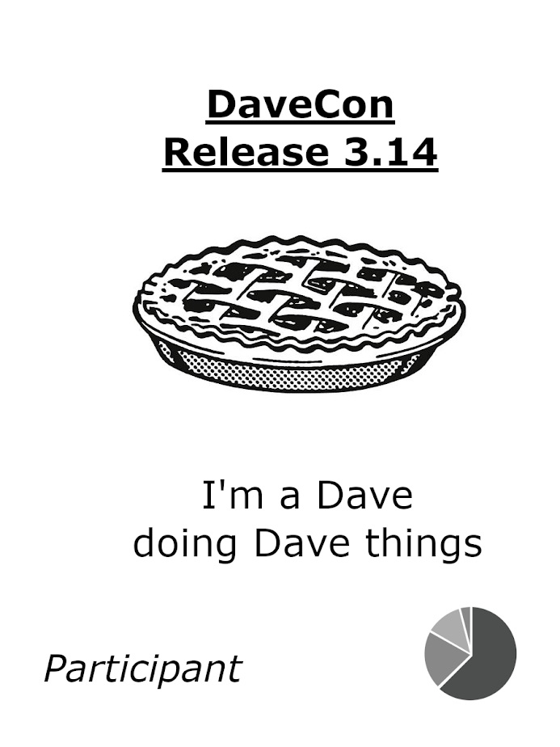 | 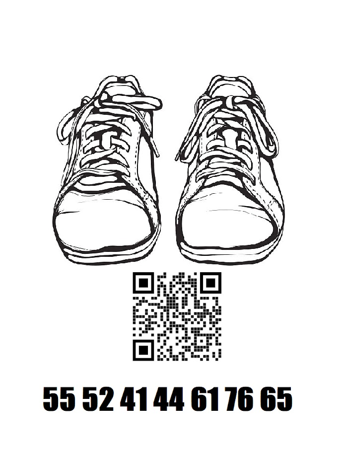 |

### DC33 (4.2)

| Front | Back |
| --- | --- |
| 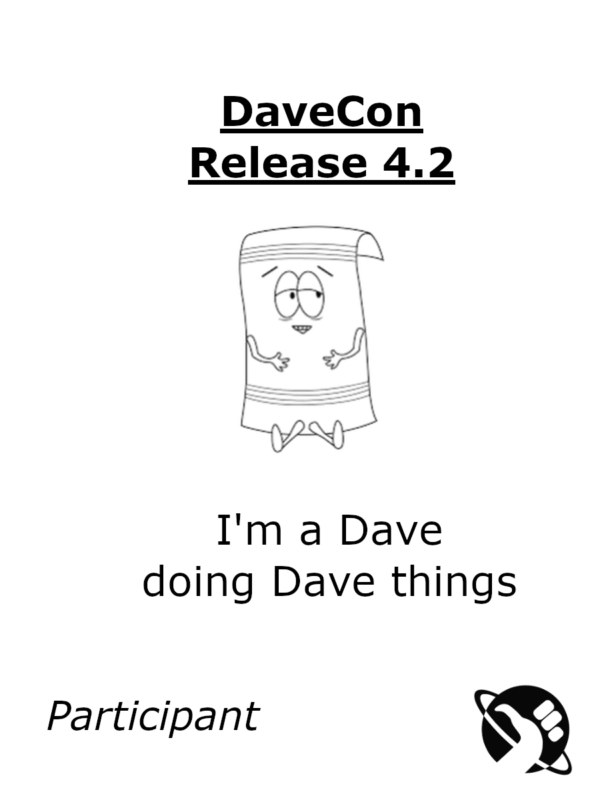 | 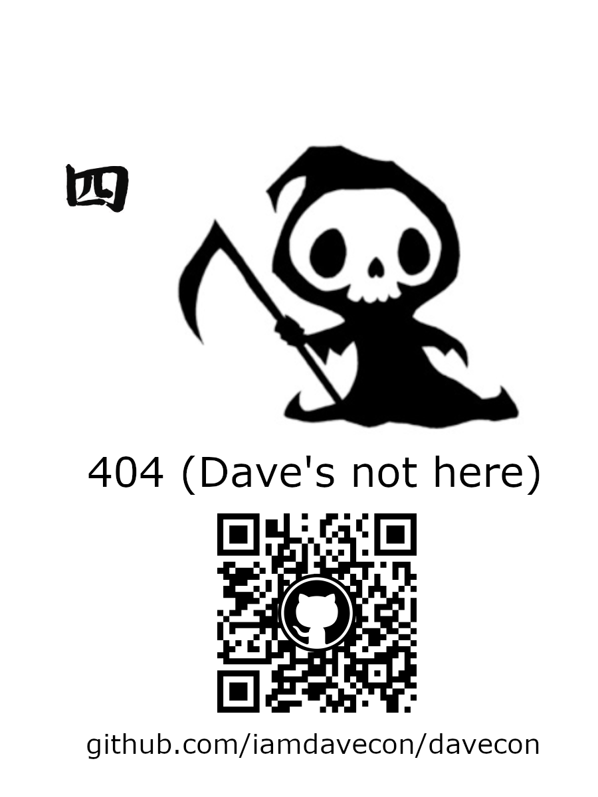 |

### DC34 (V)

| Front | Back |
| --- | --- |
| 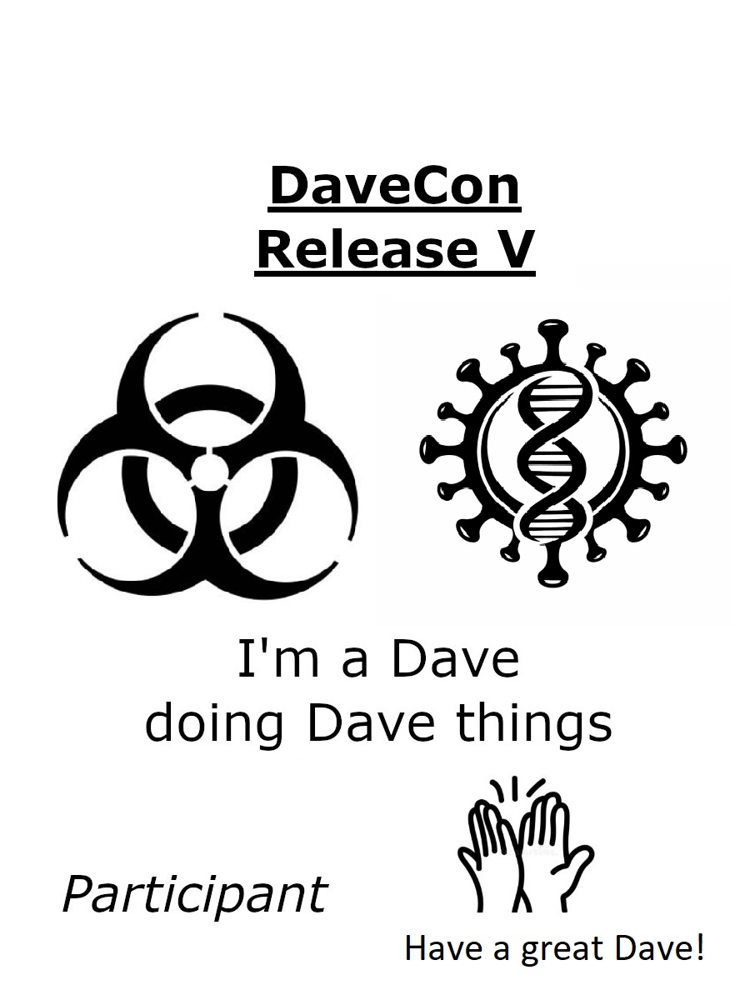 | 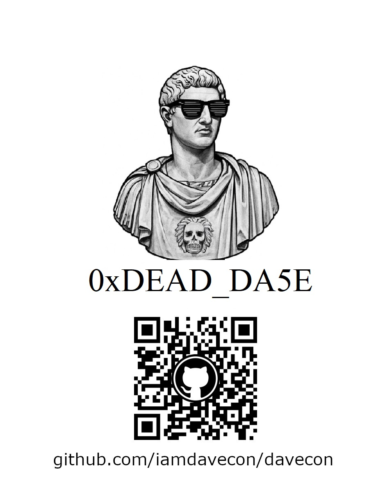 |

### DC35 (6.6.6)

| Front | Back |
| --- | --- |
| 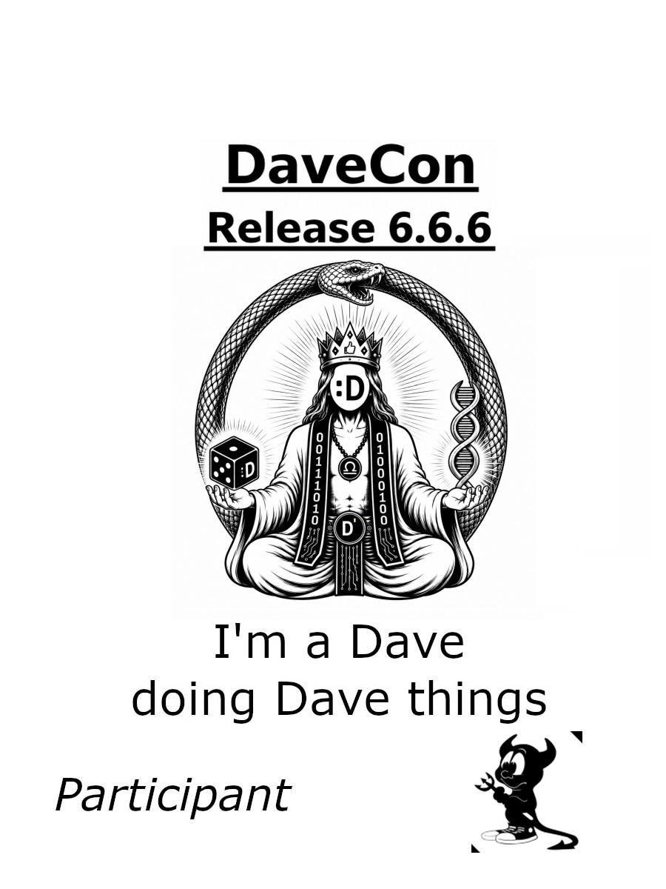 | 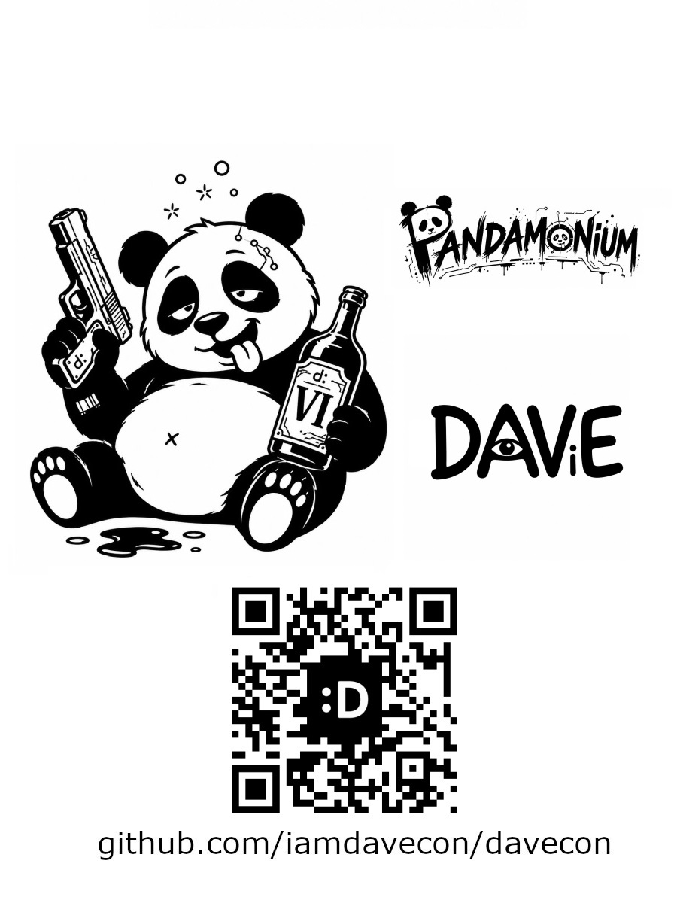 |

